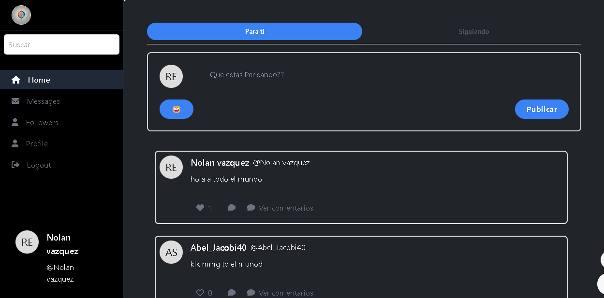
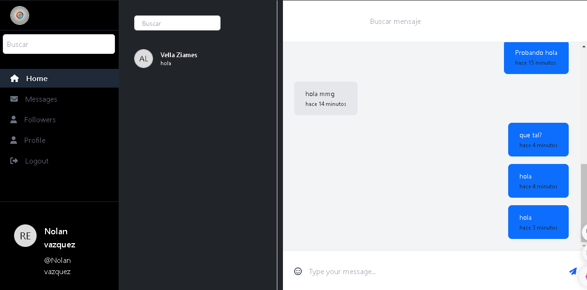
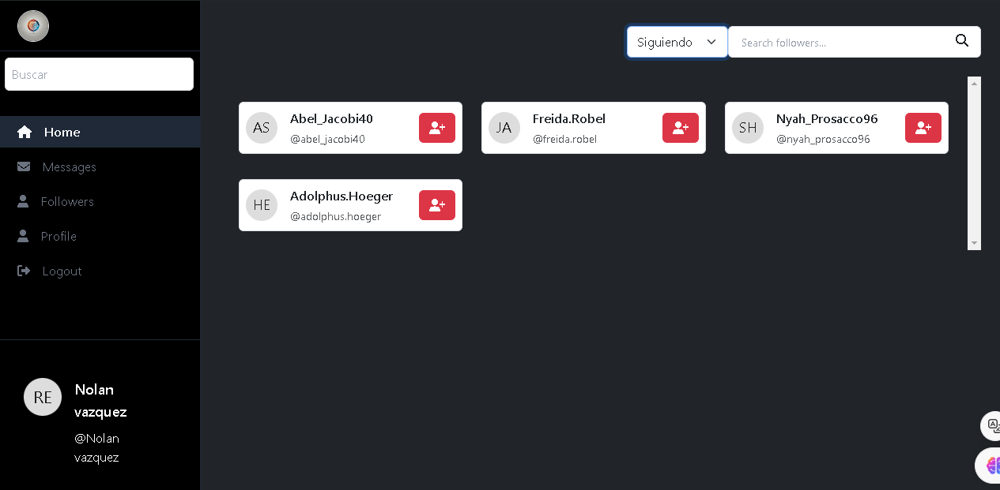
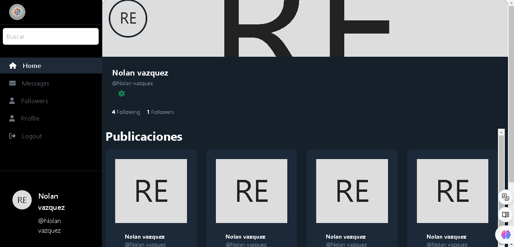
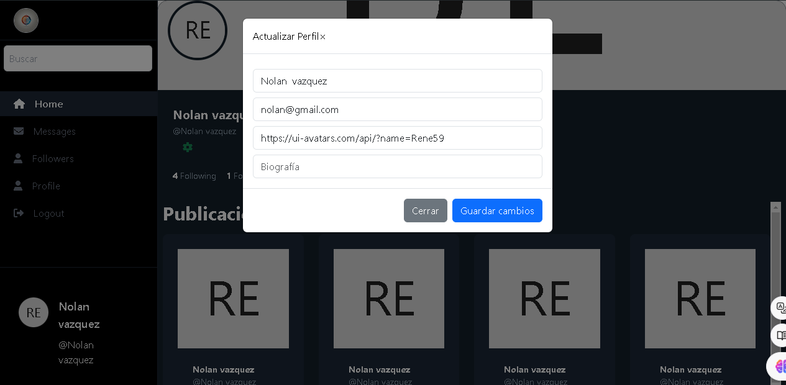

# Proyecto Twitter Clone 
 
Este proyecto es una aplicación que emula las funcionalidades básicas de la red social Twitter. A continuación, se detallan las características disponibles en cada sección de la aplicación. 
 
## Funcionalidades 
 
### Home 
- En esta sección, los usuarios pueden ver las publicaciones de otros usuarios y crear sus propias publicaciones.  
- Actualmente, solo se permite la creación de publicaciones de texto; no se admiten imágenes ni archivos. 
- Los usuarios pueden dar "me gusta" y comentar en las publicaciones. 
- Al hacer clic en una publicación, se redirige a la sección de comentarios de esa publicación. 

### Mensajes 
- En esta sección, los usuarios pueden chatear en tiempo real con otros usuarios de la plataforma, facilitando la comunicación y el intercambio de ideas. 

### Seguidores 
- Aquí puedes ver la lista de tus seguidores y las personas a las que estás siguiendo, lo que te permite gestionar tu red social de manera efectiva. 

### Perfil 
- En la sección de perfil, los usuarios pueden ver su información personal, revisar las publicaciones que han realizado y actualizar sus datos cuando sea necesario. 

